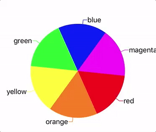
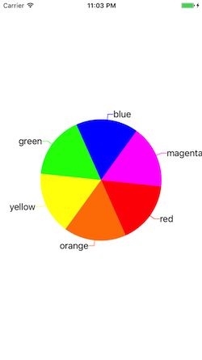

# CSPieChart

[](http://cocoapods.org/pods/CSPieChart)
[](http://cocoapods.org/pods/CSPieChart)




## Example

To run the example project, clone the repo, and run `pod install` from the Example directory first.

## Requirements

## Installation

CSPieChart is available through [CocoaPods](http://cocoapods.org). To install
it, simply add the following line to your Podfile:

```ruby
pod "CSPieChart"
```

## Useage





First Step  - `@import CSPieChart` to your project

Second Step - You should `CSPieChartData`. This is model for piechart.
```Swift
  let data = CSPieChartData(title: "test", value: 70)
```

Third Step - Add a delegate `CSPieChartDataSource` & `CSPieChartDelegate` to your class & add two delegate methods 
```Swift
public protocol CSPieChartDataSource {
    //  This is data for component
    func numberOfComponentData() -> Int
    func pieChartComponentData(at indexPath: IndexPath) -> CSPieChartData
    
    //  This is colors that is component
    func numberOfComponentColors() -> Int
    func pieChartComponentColor(at indexPath: IndexPath) -> UIColor
    
    //  If you implement this, you can show subView. example) 'UIImageView' or 'UILable'
    //  Caution!! You must designate view frame.
    func numberOfComponentSubViews() -> Int
    func pieChartComponentSubView(at indexPath: IndexPath) -> UIView
    
    //  If you are implement this, you apply color to line path
    //  Otherwish line color is applied default 'black'
    func numberOfLineColors() -> Int
    func pieChartLineColor(at indexPath: IndexPath) -> UIColor
}
```
```Swift
public protocol CSPieChartDelegate {
    func didSelectedPieChartComponent(at indexPath: IndexPath)
}
```

You can set some option

```Swift
    //  Pie chart radius rate that is percentage of frames in the superview. default is 0.7
    public var pieChartRadiusRate: CGFloat = 0.7
    
    // Pie chart line length between component and subview. default is 10
    public var pieChartLineLength: CGFloat = 10
    
    //  This is piechart component selecting animation. default is none
    public var seletingAnimationType: SelectingAnimationType = .none
}
```

If you need more information, check example

## Author

chansim.youk, dbrckstla@naver.com

## License

CSPieChart is available under the MIT license. See the LICENSE file for more info.
